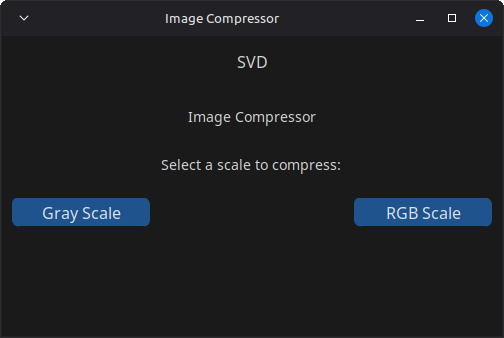
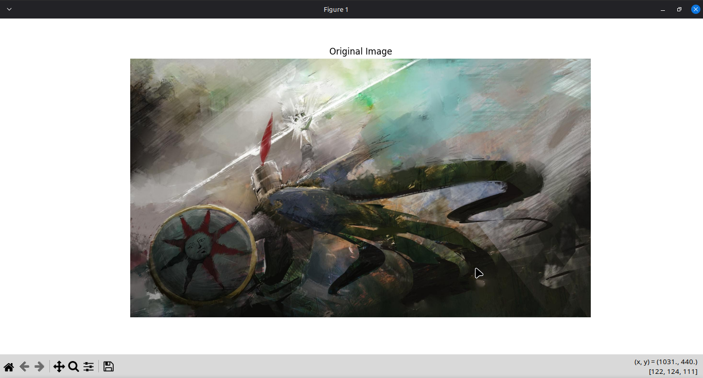
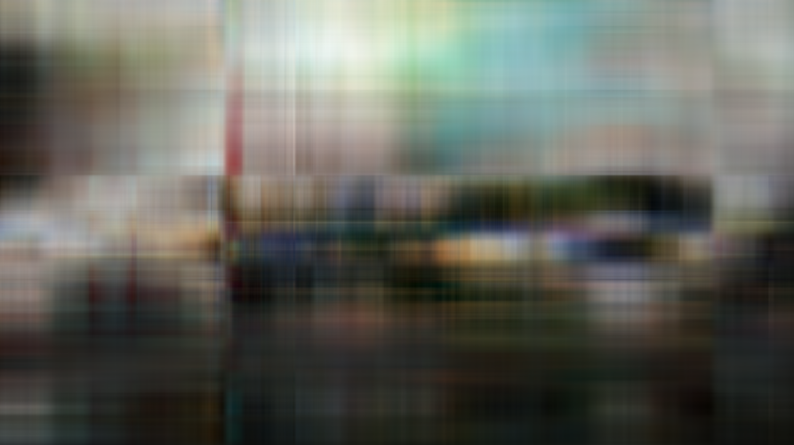

# svdic
`svdic` is a tool developed using singular value decomposition (*SVD*) for image compression.

## Prerequisites 
This project uses [Tkinter](https://github.com/python/cpython/blob/main/Modules/_tkinter.c) as well as [Matplotlib](https://github.com/matplotlib/matplotlib) for the GUI. Depending on your OS, you may need to install it manually.

## Installation
``` 
git clone https://github.com/FerRojasChoco/svdic.git
cd svdic
```

### Using pip
```
pip install -r requirements.txt
```
## Usage
```
python3 interfaceGUI.py
```
  
Select whether the compression will use grayscale or the original colors, then choose an image to be compressed.

The provided image is first shown, close the viewer and wait a moment until the program displays one version of the compressed image (e.g: *k=5*), repeat the process so all the versions are displayed, then keep the one you prefer.


In this example we can see how different values for "*k*" impact on the image. The lower the quality, the lower the size of the file.  
All images are then saved in the root folder of the project.  

### Author's note
Further development of the project for including bulk image processing, optimization, and a more intuitive procedure for the saved images process is to be expected.

## Features
*Compression Modes*:
  - Compress grayscale versions of images.
  - Compress RGB images while maintaining color fidelity.
*User Interface*:
  - Upload and compress images via GUI.
  - Preview and download compressed versions of uploaded images.
*Efficiency*:
  - Significant file size reduction without major loss of quality.
  - Supports popular formats such as JPG, PNG, and JPEG.

## Repository Contents
- [`SVD_Image_compression.pdf`](/SVD_Image_compression.pdf): Project report detailing the theory, implementation, and results of the image compression.
- [`funtionsvd.py`](/funtionsvd.py): Python script handling the image processing and SVD logic for compression.
- [`interfaceGUI.py`](/interfaceGUI.py): Python script providing the graphical user interface for interacting with the program.

## Theory Behind the Project
Singular Value Decomposition is a mathematical approach to factorizing a matrix into three components: two orthogonal matrices (`U and V^T`) and a diagonal matrix (`Σ`). In the context of image compression:
- Images are treated as matrices of pixel values.
- By truncating less significant singular values, we reduce the amount of data while preserving the most critical image features.
- Adjusting the rank of approximation (`“k”`) allows control over the balance between compression and quality.

Further details including the mathematical foundation are provided in the report (`[SVD_Image_compression.pdf](/SVD_Image_compression)`).

## Collaborators
This project was a collaborative effort between me and [Nicolás Vega](https://github.com.NicoVegaPortaluppi)

## License
[MIT](https://choosealicense.com/licenses/mit/)

---

For any questions or suggestions, please refer to the report or contact the authors.

